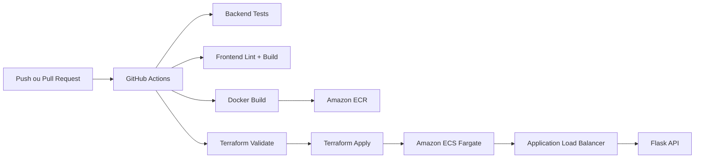

<div align="center">

# DevOps Cloud Project

### Infraestrutura como Código, CI/CD e deploy em AWS em um case de portfólio com foco visual e técnico

[](https://developer.hashicorp.com/terraform)
[](https://aws.amazon.com/)
[](https://github.com/features/actions)
[](https://www.docker.com/)

</div>

> Projeto pensado para GitHub e LinkedIn: uma aplicação containerizada com **Terraform + Docker + GitHub Actions + AWS ECS Fargate**, desenhada para demonstrar competências reais de Infraestrutura, Cloud e DevOps.

<p align="center">
  <a href="https://github.com/FelipeAlMuniz">GitHub</a> •
  <a href="https://www.linkedin.com/in/felipe-alves-muniz">LinkedIn</a>
</p>

## Visão Rápida

| Destaque | Entrega |
| --- | --- |
| Infra as Code | Provisionamento AWS com Terraform |
| CI/CD | Pipeline no GitHub Actions com validação e deploy |
| Containers | Build Docker e push para Amazon ECR |
| Runtime | Deploy em Amazon ECS Fargate com ALB |
| Observabilidade | Health check e logs no CloudWatch |

## Hero do Projeto

Este repositório foi estruturado como um case de portfólio para mostrar uma jornada completa de entrega:

- desenvolvimento de aplicação full stack simples
- containerização com Docker
- provisionamento de infraestrutura em AWS com Terraform
- automação de pipeline CI/CD
- publicação de um projeto com narrativa clara para recrutadores e times técnicos

## Identidade Visual do Projeto

Além da parte técnica, a apresentação foi tratada como parte do produto:

- frontend com hero section, cards e narrativa visual mais premium
- README com leitura mais escaneável para GitHub e LinkedIn
- estrutura pensada para parecer um case publicado, não apenas um laboratório isolado

## Arquitetura



## Stack

### Aplicação

- `Flask` para API REST e health check
- `React + Vite` para interface frontend
- `SQLite` para persistência simples
- `Docker` e `Docker Compose` para execução local

### Cloud e automação

- `Terraform` para VPC, subnets, security groups, ECR, ECS, ALB e CloudWatch
- `GitHub Actions` para testes, lint, build e deploy
- `AWS OIDC` para autenticação segura do pipeline

## O Que Este Projeto Demonstra

<table>
  <tr>
    <td width="50%">
      <strong>Infraestrutura</strong><br />
      Versionamento de ambiente, padronização e provisionamento reprodutível.
    </td>
    <td width="50%">
      <strong>Automação</strong><br />
      Pipeline que valida aplicação e infraestrutura antes do deploy.
    </td>
  </tr>
  <tr>
    <td width="50%">
      <strong>Cloud</strong><br />
      Uso de serviços AWS alinhados com cenários reais de deploy moderno.
    </td>
    <td width="50%">
      <strong>Portfólio</strong><br />
      Estrutura de projeto feita para comunicar valor técnico com clareza.
    </td>
  </tr>
</table>

## Recursos Provisionados com Terraform

Os arquivos em `terraform/` constroem a base cloud do projeto:

- VPC com duas subnets públicas
- Internet Gateway e roteamento
- Security Group para o Load Balancer
- Security Group para o serviço ECS
- Amazon ECR para armazenamento das imagens
- Amazon ECS Fargate para execução da aplicação
- Application Load Balancer com health check em `/health`
- CloudWatch Log Group para logs iniciais

## Fluxo de CI/CD

O workflow em `.github/workflows/deploy.yml` cobre:

1. testes do backend com `unittest`
2. lint do frontend com `eslint`
3. build do frontend com `vite`
4. validação de infraestrutura com `terraform fmt`, `terraform init` e `terraform validate`
5. build e push da imagem Docker para o Amazon ECR
6. deploy da aplicação na AWS com Terraform

## Estrutura do Repositório

```text
.
|-- app/                     # Backend Flask e testes
|-- frontend/                # Frontend React
|-- terraform/               # Infraestrutura AWS com Terraform
|-- .github/workflows/       # Pipeline de CI/CD
|-- Dockerfile
|-- docker-compose.yml
|-- README.md
```

## Execução Local

### Backend

```bash
python -m pip install -r app/requirements.txt
python app/main.py
```

### Frontend

```bash
cd frontend
npm install
npm run dev
```

### Docker

```bash
docker build -t devops-cloud-project .
docker run -p 8080:5000 devops-cloud-project
```

### Docker Compose

O Windows da sua máquina pode reservar a porta `5000`, então o `docker-compose.yml`
usa por padrão a porta `8080` no host.

```bash
docker compose up --build
```

No container, o código da aplicação fica em `/app` e o banco SQLite fica persistido
em `/data/tasks.db`.

Se quiser trocar a porta externa:

```bash
$env:APP_PORT=8081
docker compose up --build
```

## Variáveis de Exemplo do Terraform

```hcl
project_name    = "devops-cloud-project"
aws_region      = "us-east-1"
container_image = "123456789012.dkr.ecr.us-east-1.amazonaws.com/devops-cloud-project:latest"
environment     = "production"
```

## Secrets Esperados no GitHub

Para ativar o deploy automático no GitHub Actions:

- `AWS_ROLE_TO_ASSUME`
- `AWS_REGION`

## Configuração de AWS OIDC

O deploy usa `aws-actions/configure-aws-credentials@v4` com OIDC. Se o workflow falhar com:

```text
Could not load credentials from any providers
```

normalmente significa que o secret `AWS_ROLE_TO_ASSUME` não existe no GitHub ou que a trust policy do role na AWS ainda não permite o repositório assumir o role.

### 1. Criar o provider OIDC na AWS

No IAM da AWS, crie o provider:

- Provider URL: `https://token.actions.githubusercontent.com`
- Audience: `sts.amazonaws.com`

### 2. Criar o role usado pelo GitHub Actions

Exemplo de trust policy para este repositório:

```json
{
  "Version": "2012-10-17",
  "Statement": [
    {
      "Effect": "Allow",
      "Principal": {
        "Federated": "arn:aws:iam::<AWS_ACCOUNT_ID>:oidc-provider/token.actions.githubusercontent.com"
      },
      "Action": "sts:AssumeRoleWithWebIdentity",
      "Condition": {
        "StringEquals": {
          "token.actions.githubusercontent.com:aud": "sts.amazonaws.com"
        },
        "StringLike": {
          "token.actions.githubusercontent.com:sub": "repo:FelipeAlMuniz/devops-ci-cd-cloud-project:*"
        }
      }
    }
  ]
}
```

### 3. Permissões mínimas do role

O role precisa conseguir operar os serviços usados pelo pipeline, como:

- `ecr:*` ou permissões específicas de push/pull no Amazon ECR
- `ecs:*` ou permissões específicas do ECS/Fargate
- `elasticloadbalancing:*`
- `logs:*`
- `ec2:*` para componentes de rede criados pelo Terraform
- `iam:*` apenas se o Terraform for criar roles/policies
- `sts:GetCallerIdentity`

Em ambiente real, o ideal é restringir isso por recurso e por ação.

### 4. Configurar os secrets no GitHub

Em `Settings > Secrets and variables > Actions`, configure:

- `AWS_ROLE_TO_ASSUME`
  Exemplo:
  `arn:aws:iam::123456789012:role/github-actions-deploy-role`
- `AWS_REGION`
  Exemplo:
  `us-east-1`

### 5. O que o workflow agora valida

O workflow em `.github/workflows/deploy.yml` faz uma checagem explícita antes do deploy. Se o secret `AWS_ROLE_TO_ASSUME` estiver vazio, ele falha com uma mensagem clara em vez de deixar o erro genérico do provider da AWS.

## Valor para GitHub e LinkedIn

Este projeto foi desenhado para ser fácil de apresentar publicamente. Ele ajuda a comunicar:

- domínio de Terraform e Infraestrutura como Código
- visão prática de pipeline CI/CD
- experiência com Docker e runtime em cloud
- organização de repositório com narrativa técnica clara
- maturidade para publicar um case completo, não apenas snippets isolados

## Próximos Passos Recomendados

- adicionar ambiente `staging`
- migrar o banco para `Amazon RDS PostgreSQL`
- publicar o frontend em `S3 + CloudFront`
- incluir `terraform plan` automático em pull requests
- adicionar alarmes com `CloudWatch`
