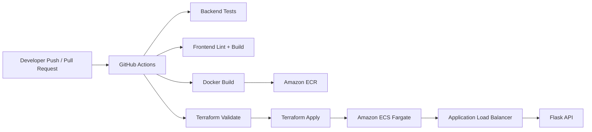

# DevOps Cloud Project

[](https://developer.hashicorp.com/terraform)
[](https://aws.amazon.com/)
[](https://github.com/features/actions)
[](https://www.docker.com/)

Projeto de portfólio criado para demonstrar uma esteira completa de DevOps moderna: aplicação containerizada, infraestrutura provisionada com Terraform e pipeline CI/CD automatizado para deploy em AWS.

## Why This Project Stands Out

- Mostra domínio prático de Infraestrutura como Código com Terraform
- Demonstra deploy de aplicação em AWS ECS Fargate com ALB e ECR
- Inclui pipeline CI/CD no GitHub Actions com validação de aplicação e infraestrutura
- Combina visão de infraestrutura, automação e operação em um único case publicável

## Recruiter Snapshot

Este projeto foi pensado para representar o perfil de um analista de infraestrutura em evolução para Cloud, DevOps e automação. O foco não está apenas em subir uma aplicação, mas em provar capacidade de estruturar ambiente, pipeline, versionamento e fluxo de entrega contínua de ponta a ponta.

## Architecture



## Tech Stack

### Application Layer
- `Flask` para API REST e endpoint de health check
- `React + Vite` para dashboard frontend
- `SQLite` para persistencia simples da aplicacao
- `Docker` e `Docker Compose` para execucao local

### Cloud And Automation
- `Terraform` para provisionar VPC, subnets, security groups, ECR, ECS, ALB e CloudWatch
- `GitHub Actions` para testes, lint, build e deploy
- `AWS OIDC` como estrategia recomendada para autenticacao segura do pipeline

## What Is Provisioned With Terraform

Os arquivos em `terraform/` provisionam a base cloud do projeto:

- VPC com duas subnets publicas
- Internet Gateway e roteamento
- Security Group para Load Balancer
- Security Group para ECS Service
- Amazon ECR para armazenamento de imagens
- Amazon ECS Fargate para execucao da aplicacao
- Application Load Balancer com health check em `/health`
- CloudWatch Log Group para observabilidade inicial

## CI/CD Flow

O workflow em `.github/workflows/deploy.yml` cobre:

1. testes do backend com `unittest`
2. lint do frontend com `eslint`
3. build do frontend com `vite`
4. validacao de infraestrutura com `terraform fmt`, `terraform init` e `terraform validate`
5. build e push de imagem Docker para o Amazon ECR
6. deploy da aplicacao na AWS com Terraform

## Repository Structure

```text
.
|-- app/                     # Backend Flask e testes
|-- frontend/                # Frontend React
|-- terraform/               # Infraestrutura AWS com Terraform
|-- .github/workflows/       # Pipeline de CI/CD
|-- Dockerfile
|-- docker-compose.yml
|-- README.md
```

## Local Run

### Backend

```bash
python -m pip install -r app/requirements.txt
python app/main.py
```

### Frontend

```bash
cd frontend
npm install
npm run dev
```

### Docker

```bash
docker build -t devops-cloud-project .
docker run -p 5000:5000 devops-cloud-project
```

## Example Terraform Variables

```hcl
project_name    = "devops-cloud-project"
aws_region      = "us-east-1"
container_image = "123456789012.dkr.ecr.us-east-1.amazonaws.com/devops-cloud-project:latest"
environment     = "production"
```

## GitHub Secrets Required

Para ativar o deploy automatico no GitHub Actions, configure:

- `AWS_ROLE_TO_ASSUME`
- `AWS_REGION`

## Portfolio Value

Este repositorio comunica bem competencias que costumam ser muito valorizadas em vagas de infraestrutura, cloud e DevOps:

- versionamento de infraestrutura
- automacao de deploy
- containerizacao de aplicacoes
- validacao automatizada em pipeline
- integracao entre desenvolvimento e operacao

## Suggested Next Steps

- adicionar ambiente `staging`
- migrar o banco para `Amazon RDS PostgreSQL`
- separar frontend e publicar em `S3 + CloudFront`
- incluir `terraform plan` automatico em pull requests
- adicionar monitoracao com `CloudWatch Alarms`

## LinkedIn Post Idea

Exemplo de descricao curta para divulgar este projeto:

> Desenvolvi um projeto de portfólio focado em DevOps e Cloud com Terraform, GitHub Actions, Docker e AWS ECS Fargate. A proposta foi demonstrar uma esteira completa, desde Infraestrutura como Código até CI/CD com deploy automatizado.
